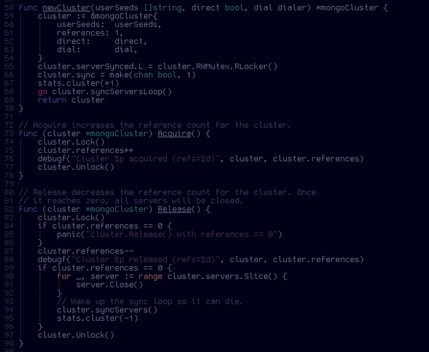

## Plum colorscheme

Plum is a simple dark colorscheme for vim.

### Options

**g:plum\_cursorline\_highlight\_only\_linenr**: when `cursorline` is set, only the current the line number is highlighted.
```vim
let g:plum_cursorline_highlight_only_linenr = 0   " default
```


### Palette

Here a preview of the colorscheme color palette inside MacVim.

   
